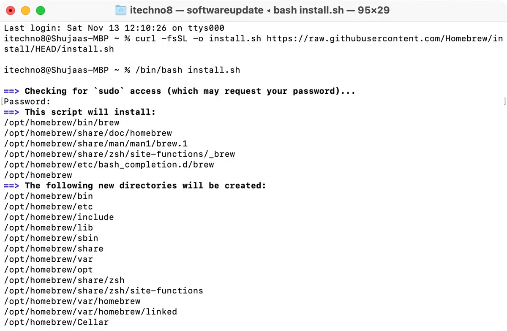
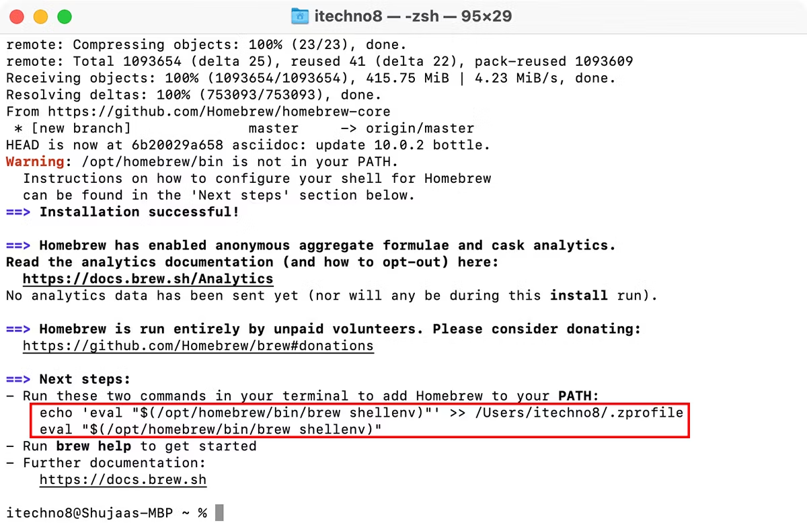

#  Create Windows 11 Bootable Disk Using Terminal (M1/M2 Macs)

The second method we'll cover today involves using Terminal. The  process is relatively simple; however, a limitation of this method is  the issue of the installer being 5.2GB. You cannot burn a file bigger  than 4GB on a FAT32 formatted drive, which is the only format that works with both Windows and macOS.

A workaround for this is to split the installer into smaller files,  which requires the installation of a package manager, wimlib, that is  installed through Homebrew. This will split the Windows installer file  while creating the bootable disk.

To install Homebrew and create a bootable Windows 11 USB, open **Terminal** on your Mac from **Finder > Applications** and enter the following commands. Once you have entered a command, press **Enter**:

```
curl -fsSL -o install.sh https://raw.githubusercontent.com/Homebrew/install/HEAD/install.sh
/bin/bash install.sh
```

​         

 This process will download and install Xcode before installing  Homebrew. Xcode is an integrated development environment (IDE) that is  comprised of software development tools for macOS. The process may take a few minutes to complete.

You will be required to type in your Mac user password to  authenticate yourself. You won't see anything appear on the screen when  you type it in, so just type it and press **Enter** to install Homebrew.

Once the installation is complete, enter the following command and press **Enter** to install wimlib:

```
brew install wimlib
```

You might get an error message saying **command not found:brew**, you may also see two commands in Terminal right at the end of the  previous Homebrew installation. Enter the commands to activate Homebrew, followed by he command above again to get it working successfully.

​         


 Now, make sure your USB is connected to your Mac. Run the following command:

```
diskutil list
```

This will bring up a list of drives connected to your Mac. Find and  note down the USB drive's disk identifier, which should appear to the  left of (**external, physical**), and should resemble disk2, disk3, and so on.

<iframe id="google_ads_iframe_/39363775/MUO_InContent_728x90_Desktop_4" srcdoc="<body></body>" style="position: absolute; width: 0px; height: 0px; left: 0px; right: 0px; z-index: -1; border: 0px none;" width="0" height="0"></iframe>

Use the following command to format the USB stick in Terminal (replace **disk2** with your disk identifier):

```
diskutil eraseDisk MS-DOS WINDOWS11 GPT /dev/disk2
```

Terminal should now format your disk and rename it as WINDOWS11.         

 Mount the Windows 11 ISO from the Downloads folder on your Mac. You  can do this by double-clicking on the ISO file, which should then show  up in your Mac's connected devices as **CCCOMA_X64FRE_EN-US_DV9** or similar. Remember to match the file name exactly to the one above.  If it's different (due to a different language preference), make sure to change it accordingly in the commands below.

Since the installer file is bigger than 4GB, we'll be using two  separate commands to create the bootable disk. The first command will  copy all the files apart from the install.wim file (which is 4.2GB) in  size. The second command will use wimlib to split and copy the  install.wim file to the USB stick.

Use the following command to copy the content of the ISO image—excluding the install.wim file—onto the USB drive:

<iframe id="google_ads_iframe_/39363775/MUO_InContent_728x90_Desktop_5" srcdoc="<body></body>" style="position: absolute; width: 0px; height: 0px; left: 0px; right: 0px; z-index: -1; border: 0px none;" width="0" height="0"></iframe>

```
rsync -vha --exclude=sources/install.wim /Volumes/CCCOMA_X64FRE_EN-US_DV9/* /Volumes/WINDOWS11
```

Then run the following command to split and copy the install.wim file:

```
wimlib-imagex split /Volumes/CCCOMA_X64FRE_EN-US_DV9/sources/install.wim /Volumes/WINDOWS11/sources/install.swm 3000
```

​         

 That's it! Terminal should successfully create the bootable disk, which you can now use to boot a fresh Windows installation. 


##  